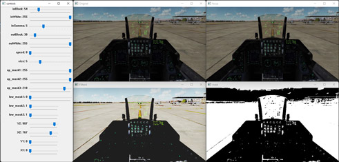
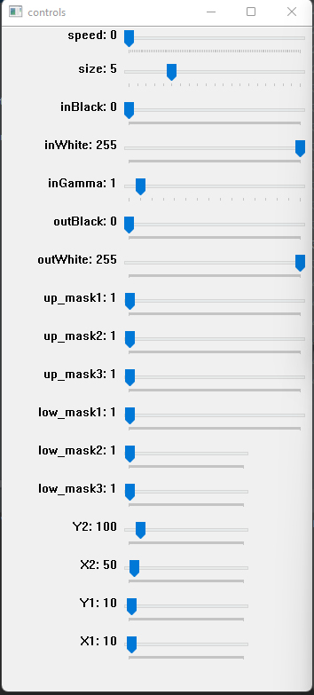

# Live edit tool for computer vision

**Tested on: win11 - Python 3.10**

**Tools list:**
* Photoshop levels
* Customize mask
* Focus frame
* Frame speed 
* Frame size



#  Installtion:

1. Clone or download the project.

2. Install the requirements packages:
```
pip install opencv-python
```
```
pip install numpy
```

3. add video file to work on into doc folder.

4. open **main.py**, change **video** at line 6 to your video file path
```
video = "docs/vid.mp4"
```

6. **Run "main.py"**


# How to use:


* **speed** - frame speed
* **size**  - frame size
* **inBlack** - input black (levels)
* **inWhite** - input white (levels)
* **outBlack** - output black (levels)
* **outWhite** - output white (levels)
* **mask**:

    [up_mask1, up_mask2, up_mask3]
    
    [low_mask1, low_mask2, low_mask3]  
* **focus**:  position - x1, x2, y1, y2
                            



